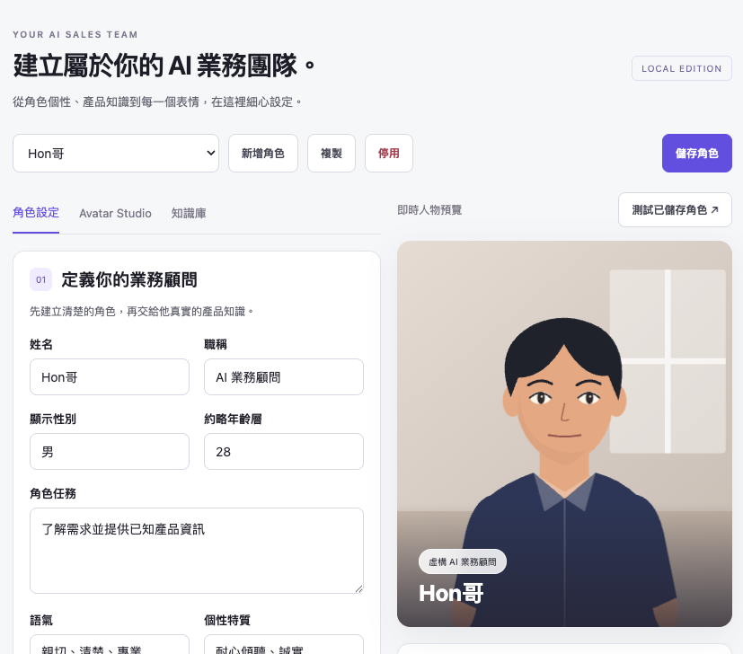

# AI Salesman · Local Studio

AI Salesman 是一個只在本機執行的 AI 業務顧問原型。它把角色設定、產品知識、文字對話、2D Avatar 動畫與語音播放整合在同一個本機介面；文字生成透過官方 Codex App Server 使用你的 ChatGPT 訂閱，應用程式本身不需要 OpenAI API key。

> 本專案目前是單使用者、本機測試版。服務固定綁定 `127.0.0.1`，請勿對外開放或直接部署到公開網路。

## 功能

- 管理多個 AI 業務角色：任務、語氣、產品資訊、規則、CTA 與 Avatar 外觀。
- 上傳 TXT、MD、PDF、DOCX 建立本機知識庫；SQLite FTS5 做中文雙字切詞與檢索，不使用 embedding。
- 每次提問只注入最相關的知識片段與最近對話，支援串流回覆、停止生成與來源顯示。
- 使用固定規則控制表情與手勢，提供 8 組參數化 SVG 人物與 5 個場景。
- 支援瀏覽器語音；macOS 可使用 `say` 產生並快取 WAV。語音輸入使用瀏覽器 Speech Recognition。
- 保留原始 V2 單檔 Demo，可由 `/legacy-studio` 開啟；其模擬互動與正式 SQLite 功能分開。

## 架構

\`\`\`text
Browser
  └─ frontend/index.html + app.js + avatar.js
       │ same-origin HTTP / SSE
       ▼
FastAPI (backend/app.py)
  ├─ domain.py       Pydantic 輸入驗證、輸出 Schema、情境規則
  ├─ storage.py      SQLite、FTS5、文件解析、hash 去重
  └─ codex_client.py 官方 Codex App Server JSONL stdio client
       ├─ ChatGPT 登入與模型狀態
       └─ ephemeral thread / streaming turn

backend/data/
  ├─ app.db           角色、設定、文件索引、對話
  ├─ knowledge/       上傳原檔
  ├─ avatars/         重新編碼後的圖片
  ├─ generated/       macOS 語音快取
  └─ codex-runtime/   App Server 工作目錄
\`\`\`

正式前端、API 與資料庫由同一個 Uvicorn 程序提供。沒有 Node build chain、背景工作佇列、embedding service、Ollama 或另一組模型 API。

## 快速開始

### 1. 安裝官方 Codex CLI 並登入

依 [官方 Codex CLI 文件](https://developers.openai.com/codex/cli) 安裝 CLI，然後在自己的 Terminal 執行：

\`\`\`sh
codex login
codex login status
\`\`\`

請確認登入的是你要使用的 ChatGPT workspace。應用程式只透過官方 App Server 讀取帳號、額度與模型狀態，不讀取認證檔，也不接收或保存 token。

### 2. 建立 Python 環境

目前以 Python 3.14、macOS arm64 與 Codex CLI 0.153.4 完整驗證；其他版本可能需要自行調整相依套件。

\`\`\`sh
python3 -m venv .venv
.venv/bin/pip install -r backend/requirements.txt
\`\`\`

### 3. 啟動

\`\`\`sh
./run-local.sh
\`\`\`

開啟以下頁面：

- [對話體驗](http://127.0.0.1:8000/)
- [業務角色工作室](http://127.0.0.1:8000/admin)
- [連線與設定](http://127.0.0.1:8000/setup)
- [本機 API 文件](http://127.0.0.1:8000/docs)

請固定使用 `127.0.0.1:8000`，不要在 `localhost` 和 `127.0.0.1` 之間切換。停止服務：在啟動服務的 Terminal 按 `Ctrl+C`。

也可以直接啟動 Uvicorn：

\`\`\`sh
.venv/bin/uvicorn backend.app:app --host 127.0.0.1 --port 8000 --no-access-log
\`\`\`

## 使用流程

1. 在「連線與設定」重新檢查 ChatGPT 登入與可用模型。
2. 在「業務角色工作室」選擇或建立角色，填寫產品資訊與銷售規則。
3. 上傳產品文件；支援 UTF-8 TXT／MD、有文字層的 PDF、DOCX，單檔上限 20 MB。
4. 在「對話體驗」選擇角色並開始提問。
5. 需要時切換瀏覽器語音或 macOS 語音，生成中可按「停止」。

知識文件只在提問時擷取最相關的片段。刪除文件會同時清除保留的對話脈絡，避免後續回答繼續引用已刪除內容。重新整理瀏覽器會建立新的畫面對話；本機舊紀錄仍可由清除工具移除。

## API 與安全邊界

- HTTP 只接受 `127.0.0.1:8000`、`localhost:8000` 與測試用 host。
- 非讀取請求需要 `x-salesman-local: 1`；跨站請求與 wildcard CORS 均拒絕。
- 上傳檔案會檢查副檔名、MIME、檔頭、大小、解析結果與檔名；PDF／DOCX 也有解壓與文字量限制。
- Codex App Server 使用 stdio、read-only sandbox、never approvals、ephemeral thread 與空 dynamic tools。
- 只允許必要的 App Server RPC；工具、程序、檔案系統與權限請求會被拒絕。
- 系統規則會要求模型只輸出指定 JSON，並對回覆做 Schema、文字一致性與固定情境規則驗證。
- 這是應用層的本機安全邊界，不是第三方認證的資安隔離。升級 Codex CLI 後應重新執行測試。

這些限制不能把本專案變成公開服務：它沒有使用者登入、多租戶、正式權限、公開部署設定、計費、背景重試或 API key 備援。

## 重要檔案

| 路徑 | 用途 |
| --- | --- |
| `backend/app.py` | FastAPI 路由、同源限制、SSE 對話、上傳與語音服務 |
| `backend/domain.py` | Pydantic models、輸出 Schema、Avatar 預設與情境規則 |
| `backend/storage.py` | SQLite、FTS5、文件解析、檢索、對話與資料刪除 |
| `backend/codex_client.py` | 官方 Codex App Server JSONL client 與安全設定 |
| `frontend/index.html` | 正式前台、管理頁與設定頁的單頁介面 |
| `frontend/app.js` | API 呼叫、對話串流、管理與語音互動 |
| `frontend/avatar.js` | 參數化 SVG Avatar 與動作控制 |
| `frontend/legacy-studio.html` | 原 V2 拆分版示範入口 |
| `legacy/AI-Salesman.original.html` | 原始單檔 V2 備份，未由正式版覆寫 |
| `tests/` | 不需訂閱的本機回歸測試與明確啟用的整合測試 |
| `scripts/` | 秘密樣式掃描與本機資料清除工具 |

## 資料與重設

正式資料都在 `backend/data/`，已由 Git 忽略，不會進入 repository。環境變數 `SALESMAN_DATA_DIR` 可將資料移到其他位置；未設定時使用專案下的 `backend/data/`。

要重設整個本機原型，先停止服務，再執行：

\`\`\`sh
.venv/bin/python scripts/clear_local_data.py --confirm
\`\`\`

這會永久刪除角色、設定、知識文件、對話與語音快取，下次啟動時建立四位預設角色；不會刪除原始 V2 備份，也不會登出 Codex。

## 測試與檢查

\`\`\`sh
.venv/bin/python -m unittest discover -s tests -v
node --check frontend/app.js
node --check frontend/avatar.js
.venv/bin/python scripts/secret_scan.py
\`\`\`

真實訂閱整合測試需要先啟動服務，再明確加上 `--run`；會消耗少量現有額度：

\`\`\`sh
.venv/bin/python tests/live_smoke.py --run
\`\`\`

截至 `TEST-REPORT.md` 的驗證紀錄，15 組本機測試、RAG 串流、文件刪除後不再引用、角色切換、停止生成、macOS WAV 快取與秘密掃描均已通過。麥克風實際收音、瀏覽器 Speech Synthesis 品質、不同瀏覽器的逐幀動畫、登入逾期與真實斷網仍需在你的環境人工驗收。

## GitHub repository 準備

本目錄就是可獨立建立 GitHub repository 的根目錄；上層目錄的舊版素材不屬於這個 repository。第一次建立本地 Git 歷史：

\`\`\`sh
git init
git add .
git commit -m "Initial AI Salesman local studio"
git branch -M main
\`\`\`

建立 GitHub repository 後，再設定 remote 並推送：

\`\`\`sh
git remote add origin https://github.com/<你的帳號>/<你的-repo>.git
git push -u origin main
\`\`\`

推送前建議再次執行測試與秘密掃描，並確認 `git status` 沒有出現 `.env`、`.venv/`、`backend/data/` 或其他本機資料。

## 已知限制

- 本機單使用者，沒有帳號、工作區權限或對話歷史 UI。
- 文字生成需要網路、有效的 ChatGPT 登入與可用額度；本機頁面和資料庫仍可在斷網時開啟。
- macOS 語音依賴系統的 `say` 與 `afconvert`；其他平台可使用瀏覽器語音，但聲音與離線行為由瀏覽器／作業系統決定。
- Avatar 是規則驅動的 2D SVG，不是真人影片、生成式唇形或即時 Digital Human。
- 原 V2 中的網站預覽、匯入、ROI 與聊天仍是 Demo 模擬，不代表已完成第三方網站嵌入或 CRM 整合。
